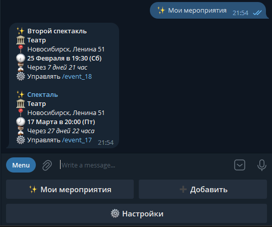

# Мои билеты

[Бот](https://t.me/MyTicketsCloudBot) для удобной работы с мероприятиями и билетами на них

### Возможности

* Добавлять города и места проведения мероприятий

* Добавлять и просматривать список актуальных мероприятий

* Управлять мероприятием

* Добавлять и просматривать билеты

* Уведомление о мероприятиях на следующей день
* Уведомление о ближайшем мероприятии

### Используемые технологии

* Python 3.11
* PostgreSQL 15
* Docker-compose